# Sixel Experiments

A collection of experiments with [sixel](https://en.wikipedia.org/wiki/Sixel) graphics.

## What is this?

This is a collection of experiments with sixel graphics, imported from [coffee website](https://gitlab.com/Matrixcoffee/sixel-experiments)

## But Coffee, what on earth are sixel graphics?

> 👉 Did you know:
>
> You can display actual bitmap images on the actual console in selected terminal emulators.
>
> [https://en.wikipedia.org/wiki/VT340](https://en.wikipedia.org/wiki/VT340)

Observe:

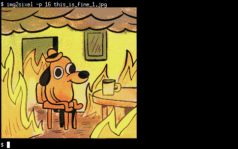

## How can I display sixel graphics?

### First you need a sixel-capable terminal emulator

[XTerm](https://invisible-island.net/xterm/) supports this, but needs a little nudging to enable:
```
$ xterm -xrm "XTerm*decTerminalID: vt340" -xrm "XTerm*numColorRegisters: 256"
```
But do you a favor and run the following:
```
$ echo "XTerm*decTerminalID: vt340" >> $HOME/.Xresources
$ echo "XTerm*numColorRegisters: 256" >> $HOME/.Xresources
$ echo "XTerm*disallowedWindowOps: 1,2,3,4,5,6,7,8,9,11,13,19,20,21,GetSelection,SetSelection,SetWinLines,SetXprop" >> $HOME/.Xresources
$ xrdb $HOME/.Xresources
```
And all your XTerm sessions will have 256-color sixel graphics enabled by default.

(The third line sets up some exceptions so we're allowed to query XTerm about its active screen size in pixels, from which we can then calculate the character cell size, which is kind of important to know when you want to align sixel graphics with text. Other terminal emulators already allow this by default.)

The only _other_ sixel-capable X terminal emulator offered by _Debian Buster_ is [mlterm](http://mlterm.sourceforge.net). No special options are needed to enable sixel graphics.

See the [libsixel home page](https://saitoha.github.io/libsixel/) for other _sixel-capable_ terminal emulators, including ones for the framebuffer console.

### Then you need some sixel graphics

* Install `libsixel-bin` and use its `img2sixel` program to display most common image formats.
* [ImageMagick](https://imagemagick.org/) (but **not** [GraphicsMagick](http://www.graphicsmagick.org/)!) can convert to and from sixel format.
* All files in this repository ending in `.sixel` can simply be shown on the terminal with `cat`.
* Working programs in this repository will emit sixel graphics, if you can figure them out.

## Status

This repository is intended for experiments, and not to hold mature programs. Programs may be in various stages of completion, and various stages of documentation, including not at all.

## experiments-screenshots

`population.awk`:

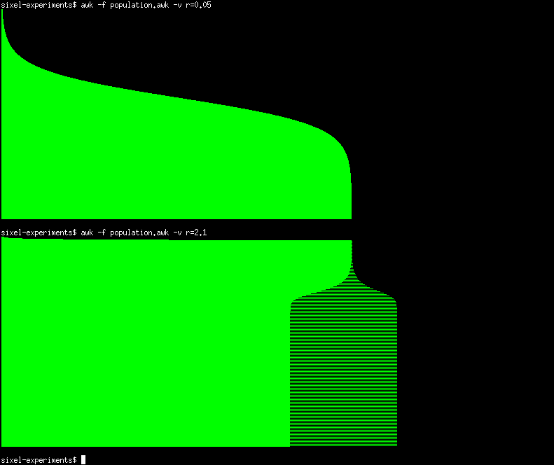

`horigraph.awk`:

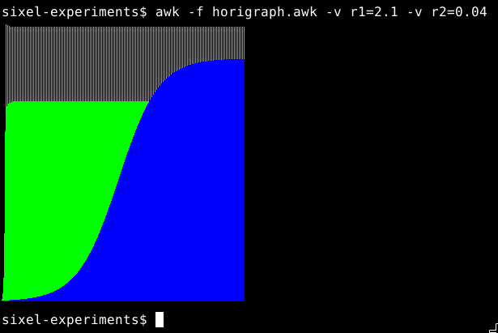

`population-bitmap.awk` (v1):

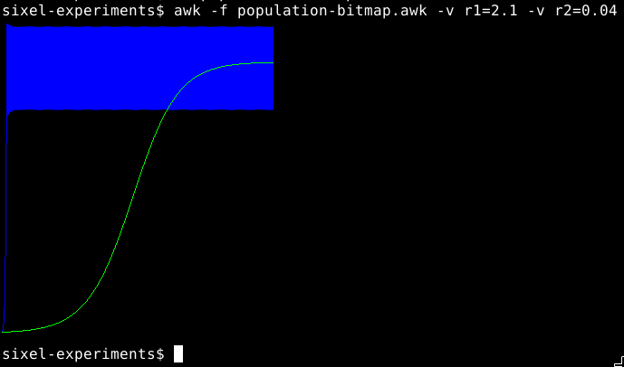

`population-bitmap.awk` (v2):

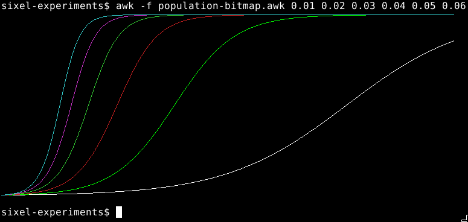

`bifur-bitmap.awk`:

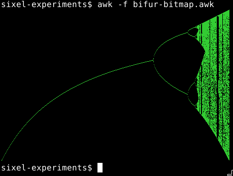

`text-test.sixel`:

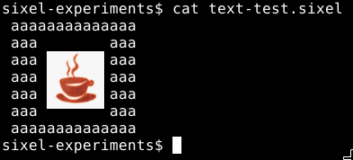

`mandelbrot-bitmap.awk` showing the full mandelbrot set:

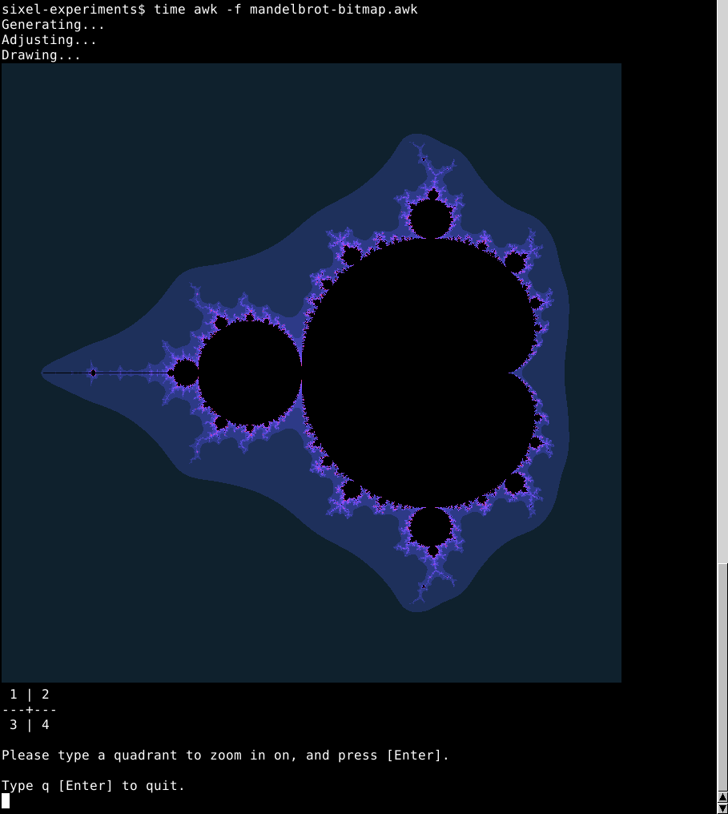

`mandelbrot-bitmap.awk` - usage - zooming in:

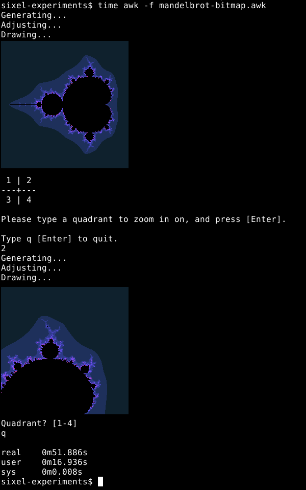

mandelbrot-bitmap.awk showing a zoomed-in view of the mandelbrot set:

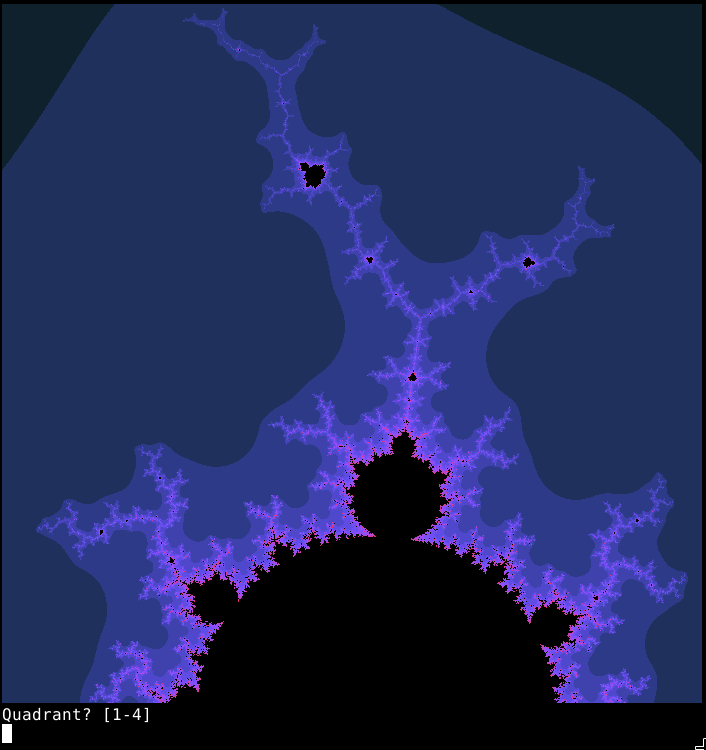

sixkcd.bash black-on-white:

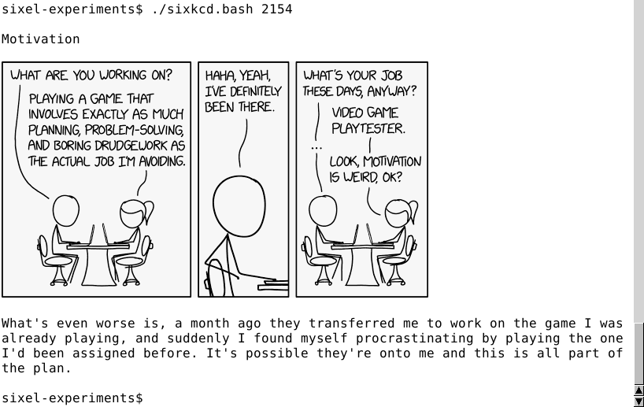

sixkcd.bash white-on-black:

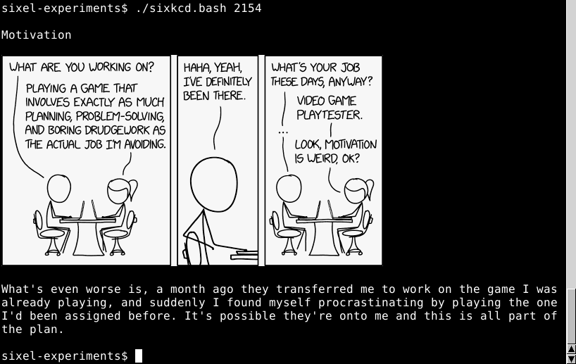

## Resources

* [Sixel](https://en.wikipedia.org/wiki/Sixel) at Wikipedia
* [Libsixel](https://saitoha.github.io/libsixel/) ([github](https://github.com/saitoha/libsixel)): Explanations, related projects, experiments-screenshots, examples. Its helper programs such as `img2sixel` are available from _Debian Buster_ package `libsixel-bin`. It also provides [Python](https://www.python.org) bindings, but sadly these aren't packaged for _Buster_.
* [All About SIXELs](https://www.digiater.nl/openvms/decus/vax90b1/krypton-nasa/all-about-sixels.text) by Chris F. Chiesa.
* [VT330/340 Programmer Reference Manual Volume 2 Chapter 14: Sixel Graphics](https://www.vt100.net/docs/vt3xx-gp/chapter14.html)
* "[Jexer](https://jexer.sourceforge.io), a text windowing system that resembles Turbo Vision. The first and only text windowing system that supports mixed text and images to Xterm via sixel. Runs on Linux, Mac, and Windows. Written in Java. Feature complete."

Supplemental resources:

* [XTerm Control Sequences](https://invisible-island.net/xterm/ctlseqs/ctlseqs.html)
* [ANSI escape code](https://en.wikipedia.org/wiki/ANSI_escape_code) at Wikipedia
* [POSIX.1-2017 Chapter 11: General Terminal Interface](https://pubs.opengroup.org/onlinepubs/9699919799/basedefs/V1_chap11.html)

## Author

[Coffee](https://gitlab.com/Matrixcoffee)

### Contact

* Website: [https://open.source.coffee](https://open.source.coffee)
* Mastodon: [@Coffee@toot.cafe](https://toot.cafe/@Coffee)

## License

Copyright (C) 2020 by Coffee (@Coffee@toot.cafe)

This program is free software: you can redistribute it and/or modify it under
the terms of the GNU Affero General Public License as published by the Free
Software Foundation, either version 3 of the License, or (at your option) any
later version.

This program is distributed in the hope that it will be useful, but WITHOUT ANY
WARRANTY; without even the implied warranty of MERCHANTABILITY or FITNESS FOR A
PARTICULAR PURPOSE.  See the GNU Affero General Public License for more
details.

The full text of this license can be found in the file called
[LICENSE](https://gitlab.com/Matrixcoffee/sixel-experiments/blob/master/LICENSE).

SPDX-License-Identifier: AGPL-3.0-or-later
[[-> link](https://spdx.org/licenses/AGPL-3.0-or-later.html)]
